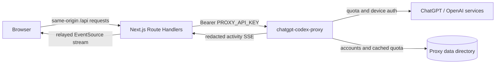

# Codex Subscription Usage

Codex Subscription Usage is a private operations dashboard for a running
[`chatgpt-codex-proxy`](https://github.com/owenqwenstarsky/chatgpt-codex-proxy)
instance. It shows account eligibility and quota, manages proxy accounts and
rotation, streams live request activity, and browses retained request logs.

This repository contains only the Next.js web UI and its server-side adapter
routes. The proxy is a separate service and remains the source of truth for
accounts, OAuth tokens, quota, routing, activity, and log retention.

> **Security:** this application intentionally has no user authentication.
> Run it only on localhost or a trusted private network. Anyone who can reach
> it can inspect proxy metadata, pull live quota, add or delete accounts,
> refresh tokens, enable or disable accounts, and change rotation settings.

## Contents

- [What the service does](#what-the-service-does)
- [How it works](#how-it-works)
- [Requirements](#requirements)
- [Quick start](#quick-start)
- [Configuration](#configuration)
- [Using the dashboard](#using-the-dashboard)
- [Usage refresh behavior](#usage-refresh-behavior)
- [Web API reference](#web-api-reference)
- [Data contracts](#data-contracts)
- [Errors and degraded operation](#errors-and-degraded-operation)
- [Security and privacy](#security-and-privacy)
- [Production operation](#production-operation)
- [Development](#development)
- [Project structure](#project-structure)
- [Troubleshooting](#troubleshooting)
- [Known limitations](#known-limitations)

## What the service does

The application has four operator-facing views:

| Path | Purpose |
| --- | --- |
| `/` | Account and quota dashboard, account onboarding, search/filter/sort, and rotation control |
| `/accounts/:id` | Account details and mutations, including live quota pull, token refresh, label/status changes, deletion, and raw usage JSON |
| `/activity` | Live, redacted request lifecycle telemetry delivered over server-relayed SSE |
| `/logs` | Paginated, filterable history of retained redacted request records by UTC day |

Major capabilities include:

- Read cached quota for every proxy account without contacting ChatGPT.
- Pull fresh quota for all enabled accounts or one selected account.
- Show primary, secondary, and code-review windows where available, including
  utilization, reset time, source, and fetch time.
- Show routing eligibility, account state, cooldowns, OAuth expiry, credits,
  and the most recent account error.
- Add accounts through the proxy's OAuth device-login flow.
- Edit labels; enable, disable, refresh, or delete accounts.
- Change rotation among `least_used`, `round_robin`, `sticky`, and
  `sticky-thread`.
- Search and filter accounts; sort by custom order, usage, reset time, or name.
- Persist custom account ordering in the current browser's `localStorage`.
- Display live request phases and outcomes, then browse the proxy's retained
  daily request logbook.

## How it works

The browser never talks to `chatgpt-codex-proxy` directly. It calls this
application's `/api/*` Route Handlers. Those handlers read the proxy API key
from server-only environment variables, authenticate to the proxy's `/admin/*`
API, and return UI-specific responses.



Important boundaries:

- `lib/proxy.ts` is marked `server-only`; importing it into a client
  component fails the build.
- `PROXY_API_KEY` has no `NEXT_PUBLIC_` prefix and is never serialized into
  browser code.
- All proxy requests use `cache: "no-store"`.
- The activity stream is relayed because browser `EventSource` cannot attach
  the proxy's authorization header.
- This app stores no accounts, OAuth tokens, quota snapshots, or request logs.
  The only browser-persisted value is custom account order.

## Requirements

- Node.js 20.9 or newer.
- npm and the checked-in `package-lock.json`.
- A reachable `chatgpt-codex-proxy` from its separate repository.
- The same `PROXY_API_KEY` configured in both services.
- At least one proxy account for useful quota and routing data.

The UI currently uses Next.js 16.3, React 19.2, TypeScript 5, Tailwind CSS 4,
SWR 2.5, and dnd-kit.

## Quick start

### 1. Start the proxy

Follow the proxy repository's setup instructions. A typical local setup is:

```bash
git clone https://github.com/owenqwenstarsky/chatgpt-codex-proxy.git
cd chatgpt-codex-proxy
cp .env.example .env
# Edit .env and set a long random PROXY_API_KEY.
docker compose up -d --build
```

The proxy listens on `http://localhost:8080` by default. Confirm its public
liveness endpoint before starting the UI:

```bash
curl http://localhost:8080/health/live
```

### 2. Configure this application

From this repository, create `.env.local` with the same key:

```dotenv
PROXY_BASE_URL=http://localhost:8080
PROXY_API_KEY=replace-with-the-proxy-key
```

`.env.local` is ignored by Git. Do not prefix either value with
`NEXT_PUBLIC_`.

### 3. Install and run

```bash
npm ci
npm run dev
```

Open <http://localhost:3000>.

If the proxy has no accounts, use **Add account** in the dashboard and finish
the displayed device authorization flow.

## Configuration

### Environment variables

| Variable | Required | Default | Description |
| --- | --- | --- | --- |
| `PROXY_API_KEY` | Yes | None | Secret used by the Next.js server to authenticate to the proxy. It must exactly match the proxy's key. |
| `PROXY_BASE_URL` | No | `http://localhost:8080` | Proxy origin, without an admin path. Trailing slashes are removed automatically. |
| `PORT` | No | `3000` | Port used by `next dev` or `next start`. Next.js reads this before loading `.env*`, so set it in the shell or process manager rather than `.env.local`. |

Examples:

```bash
# Proxy on another host in a private network
PROXY_BASE_URL=http://proxy-host:8080 npm run dev

# Production server on another port
PORT=3100 npm run start
```

### Network access

`next start` binds to `0.0.0.0` by default in this Next.js version. The dev
configuration additionally permits the Tailnet origin `100.72.80.114` for
development assets and hot reload. Update `allowedDevOrigins` in
`next.config.ts` if the development client uses a different non-local origin.

Do not expose the service to the public internet merely because it can bind to
all interfaces. Use host firewall rules, a private LAN, or a private overlay
network.

## Using the dashboard

### Usage view

The home page fetches cached account/quota data, proxy health, and rotation
state independently.

- Account data refreshes every 60 seconds and when the tab regains focus.
- The explicit **Refresh** action pulls fresh upstream usage for every enabled
  account and keeps cached values visible for disabled or failed accounts.
- Proxy health and rotation refresh every 30 seconds.
- The page schedules one extra cached refresh just after the nearest known
  cooldown, primary reset, or secondary reset, when it occurs within 24 hours.
- A green status dot means current data is healthy. Amber means the proxy is
  unreachable while saved data is visible, or one or more live pulls failed.
  Red means the proxy is unreachable and there is no account data to display.

The summary shows total accounts, currently eligible accounts, the number of
attention conditions, and the highest primary-window utilization. An account
can contribute to more than one attention condition.

Search examines label, email, local account ID, upstream account ID, user ID,
plan, and last error. Filters cover eligibility, exhausted quota, cooldown,
errors, and disabled accounts. Supported sorts are:

- Custom browser-local order
- Primary utilization, high to low
- Secondary utilization, high to low
- Primary reset soonest
- Display name alphabetically

Custom ordering can be changed by pointer or keyboard only when the view has no
search text, uses the **All accounts** filter, and uses **Custom order**. The
order is stored under `usage-viewer:account-order:v1` in browser
`localStorage`; it is not shared between browsers or users.

### Account detail

Open **Manage** on an account card to see the full account view. It supports:

- Fresh quota refresh for enabled accounts and cached refresh for disabled ones
- OAuth token refresh
- Label editing
- Enable/disable for active or disabled accounts
- Deletion with confirmation
- Primary, secondary, and code-review quota windows
- Credits, cooldown, last proxy error, OAuth expiry, quota source, quota fetch
  time, account IDs, and raw usage JSON

Expired and banned accounts cannot be re-enabled from this UI. Refreshing a
disabled account reads its cached usage without contacting ChatGPT upstream.

### Add account

**Add account** starts `POST /admin/accounts/device-login/start` through this
app, displays the returned authorization URL and code, and polls the login
record every two seconds. The flow finishes when the proxy reports `ready`,
`expired`, or `error`.

Closing the dialog does not cancel the proxy-side login. In-flight device login
state is held in proxy memory and is lost if the proxy restarts.

### Rotation settings

The rotation selector is under **Routing settings**. Changes are optimistic and
roll back if the proxy rejects the update. The control still works if the
separate health request failed, provided the rotation endpoint is reachable.

This UI only selects the configured strategy; the proxy implements the routing
semantics. Consult the proxy's
[`MULTI_ACCOUNT_ROTATION_STRATEGY.md`](https://github.com/owenqwenstarsky/chatgpt-codex-proxy/blob/main/docs/MULTI_ACCOUNT_ROTATION_STRATEGY.md)
for authoritative behavior.

### Activity

The Activity page first loads a REST snapshot, then opens `/api/activity/stream`.
It shows route, model, selected account, lifecycle phase, elapsed time, outcome,
HTTP status, and safe failure text.

The proxy stream begins with `snapshot`, continues with `upsert` and `remove`
events, and sends heartbeats. The browser reconnects automatically after a
disconnect. A timestamp guard prevents an older REST snapshot from overwriting
newer stream state. Terminal requests remain visible for about 60 seconds.

Activity search matches request ID, route, model, account ID/label, and safe
error fields. Results can also be filtered by outcome.

### Logbook

The Logbook page browses finalized records grouped by their UTC start day. It
defaults to the newest retained day and loads 50 records per page. Filters are:

- Free-text metadata search
- Outcome
- Account label or ID
- Model

Pagination uses opaque proxy cursors. Changing a filter resets the cursor
history. The proxy currently retains 30 UTC days in
`request-YYYY-MM-DD.jsonl` files; retention is a backend behavior rather than a
web UI setting.

## Usage refresh behavior

Background polling requests `mode=cached`. It lists accounts and returns quota
snapshots already stored by the proxy, so the 60-second poll and focus
revalidation do not call the upstream ChatGPT usage endpoint.

The explicit **Refresh** action requests `mode=live`. The server:

1. Lists all accounts.
2. Skips accounts whose status is `disabled`, preserving their cached quota.
3. Calls the proxy's live usage endpoint concurrently for every other account.
4. Returns fresh runtime quota where successful.
5. Falls back to each failed account's cached quota and attaches an item-level
   error instead of failing the whole response.

The route has a 90-second maximum duration; each live proxy usage request has a
30-second client timeout. A top-level failure such as an unavailable proxy or
invalid API key fails the whole operation. Individual account failures are
reported through the response's `failures` count and each item's `error`.

## Web API reference

These are same-origin endpoints provided by this Next.js application. They are
not the proxy's public OpenAI/Anthropic API. All routes are dynamic and proxy
server state without Next.js response caching.

### Health and rotation

| Method and path | Input | Result and behavior |
| --- | --- | --- |
| `GET /api/health` | None | Always returns HTTP 200. Uses unauthenticated proxy liveness first, then authenticated health. Read `proxyReachable`, `error`, and `code` from the JSON body. |
| `GET /api/rotation` | None | Returns `{ strategy, fetchedAt }`. |
| `PUT /api/rotation` | `{ "strategy": "least_used" \| "round_robin" \| "sticky" \| "sticky-thread" }` | Validates the exact strategy and updates the proxy. |

`GET /api/health` deliberately uses HTTP 200 for degraded states so the UI can
distinguish an unreachable proxy from a reachable proxy that rejected the API
key without treating the response itself as missing data.

### Accounts and usage

| Method and path | Input | Result and behavior |
| --- | --- | --- |
| `GET /api/accounts` | None | Returns `{ accounts, fetchedAt }`. |
| `GET /api/accounts/usage-all?mode=cached\|live` | Optional mode; defaults to `cached` | Returns `{ mode, items, failures, fetchedAt }`. Invalid modes return 400. |
| `GET /api/accounts/:id` | URL-encoded account ID | Returns `{ account, fetchedAt }`. Because the proxy has no single-account metadata endpoint, the server lists accounts and selects the matching ID. |
| `PATCH /api/accounts/:id` | `{ label?: string, status?: "active" \| "disabled" }` | Updates supplied fields and returns `{ account, fetchedAt }`. |
| `DELETE /api/accounts/:id` | None | Deletes the account and returns 204. |
| `GET /api/accounts/:id/usage?mode=cached\|live` | Optional mode; defaults to `cached` | Returns `{ usage, fetchedAt }`. Cached mode sends `cached=true` to the proxy; live mode omits it. |
| `POST /api/accounts/:id/refresh-token` | None | Asks the proxy to refresh OAuth credentials and returns `{ account, fetchedAt }`. |

### Device login

| Method and path | Input | Result and behavior |
| --- | --- | --- |
| `POST /api/device-login/start` | None | Starts a proxy device login and returns `{ login, fetchedAt }`. |
| `GET /api/device-login/:loginId` | URL-encoded login ID | Returns the current `{ login, fetchedAt }` record. |

### Activity and logs

| Method and path | Input | Result and behavior |
| --- | --- | --- |
| `GET /api/activity` | None | Returns the proxy's current activity snapshot with `Cache-Control: no-store`. |
| `GET /api/activity/stream` | EventSource connection | Relays the authenticated proxy SSE stream with buffering disabled. |
| `GET /api/logs/dates` | None | Returns retained UTC day summaries with `Cache-Control: no-store`. |
| `GET /api/logs` | Required `date=YYYY-MM-DD`; optional `limit`, `cursor`, `q`, `outcome`, `account`, `model` | Validates and forwards a log query. `limit` must be 1–100; filter values are limited to 200 characters. |

Valid log outcomes are `active`, `succeeded`, `failed`, `cancelled`, and
`timed_out`.

### Error response

Most failed routes return:

```json
{
  "error": "Human-readable message",
  "code": "stable_error_code",
  "proxyStatus": 401
}
```

`proxyStatus` is present only when the upstream proxy returned a useful HTTP
status. Common mappings are:

| Condition | UI HTTP status | Code |
| --- | --- | --- |
| Missing `PROXY_API_KEY` | 500 | `config_error` |
| Proxy unreachable or timed out | 502 | `proxy_unreachable` |
| Proxy rejected the key with 401/403 | 502 | `proxy_auth_failed` |
| Proxy returned 404 | 404 | `proxy_not_found` |
| Other proxy failure | 502 | `proxy_request_failed` |
| Invalid local request input | 400 | Route-specific code such as `invalid_mode`, `invalid_json`, or `invalid_limit` |

## Data contracts

The TypeScript definitions in `lib/types.ts` mirror the proxy's `main` branch.
Dates are ISO 8601 strings.

### Account

Important `AdminAccount` fields:

| Field | Meaning |
| --- | --- |
| `id` | Proxy-local stable account ID used by all admin routes |
| `upstream_account_id` | ChatGPT account identifier |
| `user_id`, `email`, `label`, `plan_type` | Optional display metadata |
| `status` | `active`, `disabled`, `expired`, or `banned` |
| `eligible_now` | Proxy-computed routing eligibility at response time |
| `cooldown_until` | Optional temporary routing cooldown |
| `last_error` | Most recent proxy account error, if any |
| `cached_quota` | Last quota snapshot persisted by the proxy |
| `oauth_expires` | OAuth access-token expiry |
| `created_at`, `updated_at` | Proxy record timestamps |

`eligible_now` is authoritative. It includes more than the visible account
status: the proxy also considers cooldown, token availability, and quota.

### Quota snapshot

A quota snapshot contains:

- `plan_type`
- Required primary `rate_limit`
- Optional `secondary_rate_limit`
- Optional `code_review_rate_limit`
- Optional credits state (`has_credits`, `unlimited`, `balance`,
  `active_limit`)
- `source` and `fetched_at`

Each rate-limit window can include `allowed`, `limit_reached`, `used_percent`,
`reset_at`, and `limit_window_seconds`. Missing utilization or reset data is
shown as unknown rather than inferred.

The UI considers an account exhausted when either the primary or secondary
window has `limit_reached=true`. Code-review quota is displayed but does not
affect routing eligibility in the current proxy.

### Activity record

An activity/log record contains only:

- Request ID and start/end timestamps
- Route template and optional model
- Selected account ID and label
- Phase: `routing`, `upstream`, `streaming`, `finalizing`, or `complete`
- Outcome: `active`, `succeeded`, `failed`, `cancelled`, or `timed_out`
- Optional HTTP status and duration
- Optional allowlisted safe error code/message

## Errors and degraded operation

The UI is designed to preserve useful saved data during partial failures.

- If health says the proxy is down but account data is already loaded, cards
  stay visible with an amber warning.
- A failed all-account live pull does not erase the previous SWR value.
- A per-account live pull failure keeps that account's cached quota and marks
  only that item as failed.
- Optimistic rotation changes roll back on error.
- Account mutations surface an action error and retain the current view.
- Activity SSE reconnects automatically. The initial REST snapshot can still
  provide data while the stream is reconnecting.
- Malformed activity events are ignored rather than crashing the page.
- Browser storage failures disable persistent ordering but do not prevent the
  dashboard from working during the current session.

Proxy client timeouts are 15 seconds by default, 30 seconds for usage pulls,
and 60 seconds for device-login start and OAuth token refresh.

## Security and privacy

### Trust model

There is no session, login screen, authorization layer, CSRF token, or per-user
permission model in this app. Same-origin browser clients can call every local
API route. Treat network access to the app as administrative access to the
proxy.

Recommended controls:

- Bind or firewall it to localhost, a private LAN, or a private overlay network.
- If remote access is required, put it behind an authenticated reverse proxy.
- Keep `PROXY_API_KEY` only in server environment configuration.
- Use TLS whenever traffic crosses an untrusted network.
- Rotate the proxy key if it is exposed and update both services together.

### Telemetry redaction

Activity and Logbook are metadata-only by proxy contract. The backend must not
store or stream request bodies, response bodies, prompts, tool payloads,
images, files, headers, OAuth tokens, cookies, authorization values, client
addresses, user agents, query strings, upstream error bodies, or stack traces.

The UI does not perform a second redaction pass; it trusts the proxy's
authenticated admin response. Keep the proxy updated and treat changes to its
activity record schema as security-sensitive.

## Production operation

This service requires a Node.js server deployment because it uses Route
Handlers, server-only secrets, dynamic proxying, and a long-lived SSE relay. It
cannot be deployed as a purely static export.

Build and run:

```bash
npm ci
npm run build
PROXY_BASE_URL=http://proxy-host:8080 \
PROXY_API_KEY=replace-with-the-proxy-key \
npm run start
```

Operational considerations:

- Run the Next.js server under a process supervisor and restart it on failure.
- Ensure the UI host can resolve and reach `PROXY_BASE_URL`.
- Preserve streaming through any reverse proxy: disable response buffering for
  `/api/activity/stream` and allow long-lived connections.
- Give upstream and downstream proxies timeouts longer than the UI's 90-second
  live-usage routes.
- Health monitoring should inspect the JSON body of `/api/health`; HTTP 200
  alone does not mean the proxy is usable.
- This app has no persistent volume requirement. Persistent account and log
  storage belongs to `chatgpt-codex-proxy`.
- Environment variables are read by the server process. Restart the app after
  changing them.

The repository does not currently ship a Dockerfile or deployment manifest for
the web UI.

## Development

### Commands

| Command | Purpose |
| --- | --- |
| `npm run dev` | Start the Next.js development server with Turbopack |
| `npm test` | Run Node's test runner over `lib/*.test.mjs` |
| `npm run lint` | Run ESLint with Next.js core-web-vitals and TypeScript rules |
| `npx tsc --noEmit` | Type-check the project; run `npx next typegen` first if generated route types do not exist |
| `npm run build` | Create and validate the production build |
| `npm run start` | Start a previously built production server |

Before submitting changes, run:

```bash
npm test
npm run lint
npx next typegen
npx tsc --noEmit
npm run build
```

Every code change must add or update automated tests for changed behavior and
relevant edge cases. Documentation must be updated whenever behavior,
configuration, routes, operations, security assumptions, or developer workflow
changes.

### Test organization

Tests use Node's built-in test runner. Current suites cover:

- Cached versus live usage aggregation and partial failure behavior
- Browser-local account order parsing and reconciliation
- SWR cache-key contracts
- Activity reducer ordering and stale snapshot protection

The `.test.mjs` files transpile their adjacent TypeScript module in memory so
the tests do not need a separate test framework or emitted build directory.

### Backend contract changes

The backend is a separate repository. Use its `main` branch as the source of
truth for admin endpoints and response shapes. If a proxy change is needed,
make it in that repository deliberately; do not add backend implementation to
this UI repository.

When the proxy contract changes:

1. Inspect the relevant backend handlers and structs on `main`.
2. Update `lib/types.ts` and `lib/proxy.ts` as needed.
3. Update Route Handler validation and UI behavior.
4. Add or update tests.
5. Update this documentation, especially the API, data contract, security, and
   operations sections.

## Project structure

```text
subscription-usage/
├── app/
│   ├── api/                     # Server-side adapter routes to the proxy
│   ├── accounts/[id]/           # Per-account page and route states
│   ├── activity/                # Live activity page
│   ├── logs/                    # Historical logbook page
│   ├── layout.tsx               # Root layout, navigation, shared clock
│   └── page.tsx                 # Usage dashboard entry point
├── components/
│   ├── Dashboard.tsx            # Polling, filtering, sorting, refresh actions
│   ├── AccountCard.tsx          # Account summary card
│   ├── AccountDetail.tsx        # Account management UI
│   ├── AddAccount.tsx           # Device-login modal and polling
│   ├── ActivityFeed.tsx         # REST snapshot plus SSE state
│   └── Logbook.tsx              # Retained-log filters and pagination
├── lib/
│   ├── proxy.ts                 # Server-only authenticated proxy client
│   ├── types.ts                 # Proxy and UI response contracts
│   ├── usage-refresh.ts         # Cached/live all-account aggregation
│   ├── usage.ts                 # Client-safe quota summaries
│   ├── activity.ts              # Activity event reducer and pruning
│   ├── account-actions.ts       # Browser mutation helpers
│   ├── account-order.ts         # localStorage-backed custom ordering
│   ├── cache-keys.ts            # Shared SWR URL/key contract
│   ├── fetch-json.ts            # Browser JSON fetch/error helper
│   └── format.ts                # Display formatting
├── docs/                        # Design/implementation notes
├── AGENTS.md                    # Repository rules for coding agents
├── next.config.ts               # Next.js configuration
└── package.json                 # Scripts and dependencies
```

### Data and cache ownership

| State | Owner | Lifetime |
| --- | --- | --- |
| Accounts, OAuth tokens, labels, status, cached quota, cooldowns | Proxy data directory | Persistent across proxy restarts |
| Retained request logbook | Proxy JSONL files | Current proxy retention policy, presently 30 UTC days |
| Live Activity state | Proxy memory, mirrored in browser reducer | Active requests plus roughly 60 seconds after completion |
| Device-login sessions | Proxy memory | Until terminal state, expiry, or proxy restart |
| Dashboard request cache | Browser SWR cache | Current page session; periodically revalidated |
| Custom account order | Browser `localStorage` | Until cleared in that browser |

## Troubleshooting

### `PROXY_API_KEY is not set`

Create `.env.local`, add `PROXY_API_KEY`, and restart the Next.js process.
Environment changes are not reliably picked up by an already-running server.

### `Proxy rejected the API key (401/403)`

The proxy is reachable, but the keys do not match. Update the UI and proxy to
use the exact same value, then restart both processes as needed.

### `Proxy unreachable`

Check:

```bash
curl http://localhost:8080/health/live
```

Then confirm `PROXY_BASE_URL`, DNS, container networking, firewall rules, and
whether the URL should use the host's address rather than `localhost` from the
UI process's network namespace.

### Background data appears but Refresh fails

Background polling only reads proxy storage. The explicit Refresh action also
needs valid account OAuth credentials and access to the upstream ChatGPT usage
endpoint. Inspect the affected account's last error and the proxy logs. Other
accounts may still update successfully.

### An account is not eligible even though it is active

`active` is only the configured status. The proxy may mark an account
ineligible because of cooldown, expired or missing credentials, exhausted
primary/secondary quota, or another routing condition. Use the detail page and
proxy logs for context.

### Activity stays on “Reconnecting”

Verify the proxy implements `/admin/requests/activity/stream`, the API key is
valid, and any reverse proxy allows SSE without buffering or a short idle
timeout. The browser should keep retrying automatically.

### The Logbook is empty

Only finalized public inference requests are written. Confirm the proxy has
handled traffic, `DATA_DIR` is writable and persistent, and the selected UTC
day is correct. Admin requests are not the public proxy traffic described by
the Activity page.

### Type-checking reports missing generated route types

Run:

```bash
npx next typegen
npx tsc --noEmit
```

`next dev` and `next build` also generate the route types.

### Development assets fail from another machine

Add that origin's hostname or IP to `allowedDevOrigins` in `next.config.ts`,
restart `npm run dev`, and keep access restricted to a trusted network.

## Known limitations

- No application-level authentication or authorization.
- No direct editing of proxy-wide settings beyond rotation strategy.
- No account import flow other than proxy device login.
- No server-side persistence owned by the UI.
- Browser-local custom ordering does not sync across devices.
- Live usage fan-out duration grows with slow upstream account calls, though
  calls are concurrent and fail independently.
- The UI depends on private, version-sensitive proxy and upstream behavior.
- Activity and Logbook availability depends on a proxy version that implements
  the corresponding admin endpoints.

## Related documentation

- [Proxy README](https://github.com/owenqwenstarsky/chatgpt-codex-proxy)
- [Proxy rotation strategy](https://github.com/owenqwenstarsky/chatgpt-codex-proxy/blob/main/docs/MULTI_ACCOUNT_ROTATION_STRATEGY.md)
- [Activity/Logbook backend implementation request](docs/PROXY_ACTIVITY_LOGBOOK_IMPLEMENTATION_REQUEST.md)
